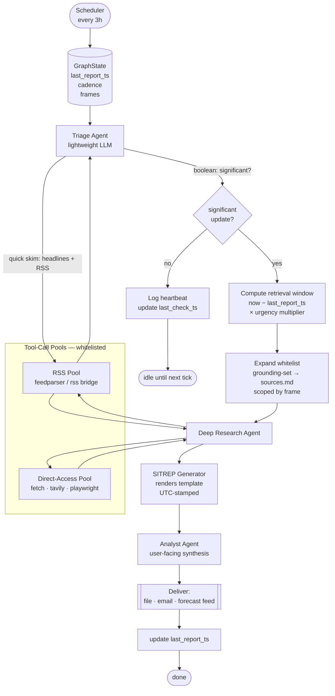
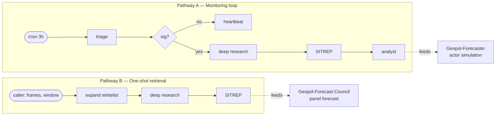

# Iran-Israel-Grounding-Package

A curated whitelist of URLs and sources for AI agents grounding analysis of the **Iran–Israel–US geopolitical conflict (2026)**, plus a LangGraph pipeline design that consumes it.

## Contents

- `AGENTS.md` — instructions for AI agents fetching this repo
- `sources.md` — the full whitelisted source list
- `grounding-set.md` — the recommended curated subset (default grounding surface)
- `.claude/skills/generate-sitrep/` — skill that produces a UTC-timestamped SITREP in a format customised for Iran–Israel–US war monitoring

---

## Pipeline design

LangGraph-based grounding pipeline that uses this repo's whitelist as its retrieval surface. Runs on a 3-hour cadence, escalates to deep research only when a triage pass detects significant activity, and emits a SITREP for downstream consumption (e.g. a geopolitical forecast producer).

### Full monitoring graph



### Suggested pathways

Two distinct usage shapes, sharing the same whitelist and SITREP template but differing in whether the triage/gate loop runs.



**Pathway A — Monitoring loop (full graph).** Long-running, scheduler-driven. Triage fires every 3h; deep research only escalates on a positive boolean. Output is a stream of dated SITREPs + heartbeats, suitable for continuous situational awareness or as a feed into a longer-horizon forecaster. Consumer example: a dashboard, an alerting channel, or [Geopol-Forecaster](https://github.com/danielrosehill/Geopol-Forecaster) that wants a pre-digested evidence base rather than running its own ingestion.

**Pathway B — One-shot retrieval (direct invocation).** Skip triage, skip scheduling. Caller supplies `(frames, window)` and the graph runs `expand → deep_research → sitrep` once. Output is a single SITREP for immediate downstream consumption. Consumer example: **[Geopol-Forecast-Council](https://github.com/danielrosehill/Geopol-Forecast-Council)** — its panel run needs one fresh SITREP per invocation, not a continuous stream. The Council already treats SITREP construction as a preflight stage; Pathway B replaces its ad-hoc RSS + Sonar + Tavily fetch with a whitelist-bounded equivalent and hands back the same shape of document.

### Handoff contract (both pathways)

| Field | Source | Consumer use |
|-------|--------|--------------|
| `sitrep.md` | `sitrep` node | grounding doc for forecaster |
| `analysis.json` | `analyst` node (A only) | delta-vs-prior, recommended horizons |
| `evidence[]` | `deep_research` node | citation floor — anything cited must trace here |
| `window_start` / `window_end` | state | explicit UTC bounds of the retrieval window |

### Nodes

| Node | Role | Model tier | Tools |
|------|------|-----------|-------|
| `triage` | Cheap boolean classifier over last-N-hours headlines. Returns `{significant: bool, reason, suggested_frames[]}`. | Haiku | RSS pool only |
| `gate` | Conditional edge on `significant`. | — | — |
| `window` | Computes `retrieval_window = now − last_report_ts`, clamped; urgency multiplier shortens/widens. | — | — |
| `expand_whitelist` | Loads `grounding-set.md` by default; expands to full `sources.md` subset filtered by `frames` (e.g. `military`, `diplomatic`, `energy-markets`). | — | File read |
| `deep_research` | Multi-step retrieval + synthesis. | Sonnet / Opus | RSS + Direct-Access pools |
| `sitrep` | Fills the `generate-sitrep` skill template. | Sonnet | — |
| `analyst` | Produces user-facing framing, delta-vs-previous-sitrep, recommended next-check time. | Sonnet | Prior SITREPs on disk |

### Tool pools

Split by access mechanism, not by source identity. Same source may appear in both (RSS for speed, scrape for depth).

- **RSS pool** — feedparser-backed; cheap; used by triage and for freshness checks.
- **Direct-access pool** — HTTP fetch, Tavily, Playwright for JS-heavy primaries/PDFs.

Both pools are hard-gated by the whitelist loaded from `sources.md`. Any URL fetched outside the whitelist raises a guard error.

### State (LangGraph)

```python
class GroundingState(TypedDict):
    last_report_ts: datetime
    last_check_ts: datetime
    cadence_seconds: int                 # default 10_800
    frames: list[str]                    # e.g. ["military", "diplomatic"]
    whitelist: dict[str, list[str]]      # pool -> urls
    triage_result: TriageResult | None
    retrieval_window: timedelta | None
    evidence: list[Evidence]
    sitrep_path: Path | None
    analysis: str | None
```

### Graph wiring (sketch)

```python
g = StateGraph(GroundingState)
g.add_node("triage", triage_node)
g.add_node("window", window_node)
g.add_node("expand", expand_whitelist_node)
g.add_node("deep_research", deep_research_node)
g.add_node("sitrep", sitrep_node)
g.add_node("analyst", analyst_node)
g.add_node("heartbeat", heartbeat_node)

g.set_entry_point("triage")
g.add_conditional_edges("triage",
    lambda s: "window" if s["triage_result"].significant else "heartbeat",
    {"window": "window", "heartbeat": "heartbeat"})
g.add_edge("window", "expand")
g.add_edge("expand", "deep_research")
g.add_edge("deep_research", "sitrep")
g.add_edge("sitrep", "analyst")
g.add_edge("analyst", END)
g.add_edge("heartbeat", END)
```

Scheduling is external (cron, systemd timer, or LangGraph's `schedules`) — the graph itself is a single-shot run per tick. Persist `last_report_ts` in a checkpointer (SQLite/Postgres) so windows and deltas survive restarts.

### Urgency multiplier

`retrieval_window = min(max(now − last_report_ts, 1h) × m, 72h)` where `m ∈ [0.5, 2.0]` is set by triage's `reason` (e.g. kinetic-event keywords → 0.5 to keep the window tight and current; diplomatic-only → 1.5 for context).

### Tool-stack minimalism

Open question: is RSS + Tavily + Perplexity Sonar all three justified, or is it stack bloat?

- **RSS** — cheap, deterministic, but latency varies per-publisher and most feeds only expose titles/summaries.
- **Tavily** — good for breadth and for sources that don't publish RSS; supports domain-scoping so the whitelist can be enforced server-side.
- **Sonar** — synthesised answers with citations; risks laundering non-whitelisted sources into the evidence chain unless citations are post-filtered.

Minimum viable stack is probably **RSS (triage) + Tavily with domain-scope (deep research)**. Sonar earns its slot only if its synthesis quality materially beats what the deep-research node produces from raw Tavily hits — worth A/B-ing before committing.

### The trailing-window problem

The genuinely hard part. Most retrieval tools expose date filters at **day** granularity, not hour. For a 3h cadence this matters:

- Tavily `days` parameter is integer-days; `published_date` in results is often missing or coarse.
- Google/Bing date operators bucket at day level and frequently ignore `qdr:h` in practice.
- RSS feeds give precise `pubDate` but only reflect what the publisher has emitted; quiet feeds produce nothing rather than "nothing new."
- Sonar's recency control is opaque.

Mitigations in order of reliability:

1. **RSS-first with per-item timestamp filter** — trust `pubDate`, drop anything older than `window_start`. The only tier that gives true sub-day granularity for free.
2. **Tavily with `days=ceil(window_hours/24)` then client-side filter** — over-fetch by a day, then filter on published_date where present; discard items lacking a timestamp unless corroborated by a timestamped source.
3. **Direct HTTP fetch of known-high-signal pages** (e.g. ISW daily update, IDF/IRGC statements pages) with ETag/Last-Modified — for primaries where freshness is load-bearing.
4. **Content-hash dedup across ticks** — a belt-and-braces check that catches anything the date filters missed; prevents yesterday's item re-surfacing as "new."

Net: the pipeline should treat "hours" as an aspirational window that's enforced in the *filter* stage, not the *fetch* stage. Over-fetch, then prune by timestamp with RSS as the authority. An item without a reliable timestamp should not count toward the window even if it appears in results.

### Open questions

- Checkpoint store: SQLite locally vs Postgres for multi-host.
- Dedup strategy across ticks (URL hash + content hash) to avoid re-surfacing yesterday's incident.
- Whether triage should ever escalate cadence (e.g. flip to 1h polling on active kinetic day).
