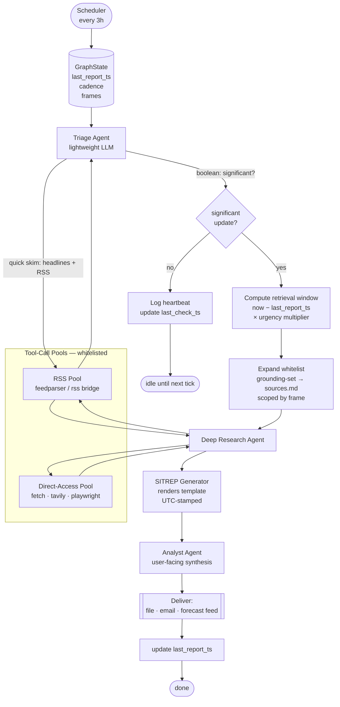

# Grounding Pipeline — Design

LangGraph-based grounding pipeline that uses this repo's whitelist as its retrieval surface. Runs on a 3-hour cadence, escalates to deep research only when a triage pass detects significant activity, and emits a SITREP for downstream consumption (e.g. a geopolitical forecast producer).

## Diagram



## Nodes

| Node | Role | Model tier | Tools |
|------|------|-----------|-------|
| `triage` | Cheap boolean classifier over last-N-hours headlines. Returns `{significant: bool, reason, suggested_frames[]}`. | Haiku | RSS pool only |
| `gate` | Conditional edge on `significant`. | — | — |
| `window` | Computes `retrieval_window = now − last_report_ts`, clamped; urgency multiplier shortens/widens. | — | — |
| `expand_whitelist` | Loads `grounding-set.md` by default; expands to full `sources.md` subset filtered by `frames` (e.g. `military`, `diplomatic`, `energy-markets`). | — | File read |
| `deep_research` | Multi-step retrieval + synthesis. | Sonnet / Opus | RSS + Direct-Access pools |
| `sitrep` | Fills the `generate-sitrep` skill template. | Sonnet | — |
| `analyst` | Produces user-facing framing, delta-vs-previous-sitrep, recommended next-check time. | Sonnet | Prior SITREPs on disk |

## Tool pools

Split by access mechanism, not by source identity. Same source may appear in both (RSS for speed, scrape for depth).

- **RSS pool** — feedparser-backed; cheap; used by triage and for freshness checks.
- **Direct-access pool** — HTTP fetch, Tavily, Playwright for JS-heavy primaries/PDFs.

Both pools are hard-gated by the whitelist loaded from `sources.md`. Any URL fetched outside the whitelist raises a guard error.

## State (LangGraph)

```python
class GroundingState(TypedDict):
    last_report_ts: datetime
    last_check_ts: datetime
    cadence_seconds: int                 # default 10_800
    frames: list[str]                    # e.g. ["military", "diplomatic"]
    whitelist: dict[str, list[str]]      # pool -> urls
    triage_result: TriageResult | None
    retrieval_window: timedelta | None
    evidence: list[Evidence]
    sitrep_path: Path | None
    analysis: str | None
```

## Graph wiring (sketch)

```python
g = StateGraph(GroundingState)
g.add_node("triage", triage_node)
g.add_node("window", window_node)
g.add_node("expand", expand_whitelist_node)
g.add_node("deep_research", deep_research_node)
g.add_node("sitrep", sitrep_node)
g.add_node("analyst", analyst_node)
g.add_node("heartbeat", heartbeat_node)

g.set_entry_point("triage")
g.add_conditional_edges("triage",
    lambda s: "window" if s["triage_result"].significant else "heartbeat",
    {"window": "window", "heartbeat": "heartbeat"})
g.add_edge("window", "expand")
g.add_edge("expand", "deep_research")
g.add_edge("deep_research", "sitrep")
g.add_edge("sitrep", "analyst")
g.add_edge("analyst", END)
g.add_edge("heartbeat", END)
```

Scheduling is external (cron, systemd timer, or LangGraph's `schedules`) — the graph itself is a single-shot run per tick. Persist `last_report_ts` in a checkpointer (SQLite/Postgres) so windows and deltas survive restarts.

## Urgency multiplier

`retrieval_window = min(max(now − last_report_ts, 1h) × m, 72h)` where `m ∈ [0.5, 2.0]` is set by triage's `reason` (e.g. kinetic-event keywords → 0.5 to keep the window tight and current; diplomatic-only → 1.5 for context).

## Integration with forecast producer

**Suggested pairing: [Geopol-Forecast-Council](https://github.com/danielrosehill/Geopol-Forecast-Council)** — the lean news-grounded panel forecaster. It already expects a timestamped SITREP as its grounding input and runs a five-model panel (GLM, DeepSeek, Gemini, Claude, Kimi) over it. This pipeline's `sitrep.md` slots in as the SITREP the Council otherwise builds ad-hoc from RSS + Perplexity Sonar + Tavily, replacing that step with a curated-whitelist equivalent that respects the repo's source policy.

Downstream forecaster consumes `sitrep.md` + `analysis.json`. The forecaster treats the whitelist bounds as its evidence floor; anything it cites must trace back to an entry in `evidence[]`.

Handoff contract:

| Field | Source | Consumer use |
|-------|--------|--------------|
| `sitrep.md` | `sitrep` node | Council's grounding doc (replaces its built-in SITREP stage) |
| `analysis.json` | `analyst` node | delta-vs-prior, recommended horizons |
| `evidence[]` | `deep_research` node | citation floor for each panel prediction |
| `last_report_ts` | state | Council's `--since` window bound |

## Open questions

- Checkpoint store: SQLite locally vs Postgres for multi-host.
- Dedup strategy across ticks (URL hash + content hash) to avoid re-surfacing yesterday's incident.
- Whether triage should ever escalate cadence (e.g. flip to 1h polling on active kinetic day).
